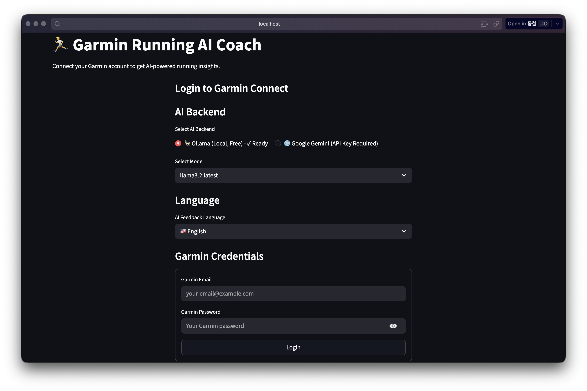
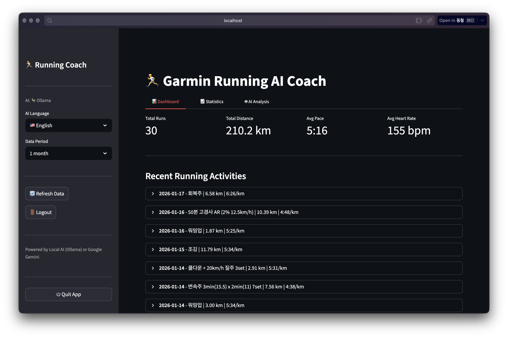
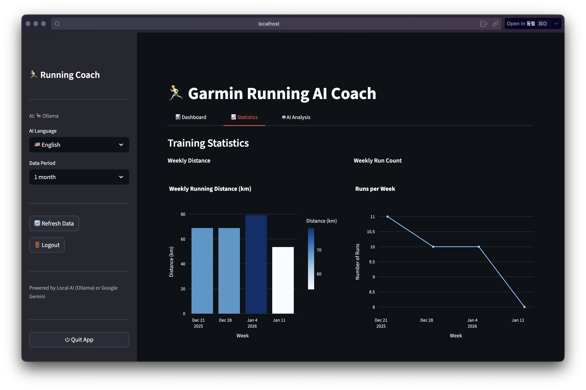
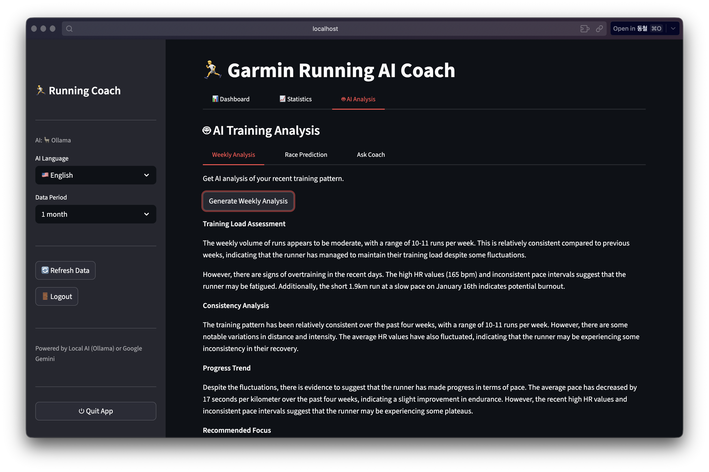

# Garmin Running AI Coach

Garmin Connect에서 러닝 데이터를 가져와 시각화하고, AI 코칭 피드백을 제공하는 데스크톱 애플리케이션입니다.



## 주요 기능

- **러닝 대시보드**: 최근 러닝 활동과 주요 지표 확인
- **상세 분석**: 심박수 존, 페이스 차트, 고도 데이터
- **주간/월간 통계**: 훈련량과 진행 상황 추적
- **AI 코칭**: 개별 러닝에 대한 맞춤 피드백
- **훈련 분석**: AI 기반 훈련 패턴 분석
- **레이스 예측**: 훈련 데이터 기반 예상 기록
- **코치에게 질문**: 러닝 관련 질문에 대한 답변
- **다국어 지원**: 영어, 한국어

## 스크린샷

| 운동 목록 | 통계 | AI 코치 |
|:---:|:---:|:---:|
|  |  |  |

---

## 사용자 가이드

### 다운로드

[Releases](https://github.com/dc7303/garmin-running-coach/releases) 페이지에서 최신 버전을 다운로드하세요.

| 플랫폼 | 파일 | 상태 |
|--------|------|------|
| macOS | `GarminRunningCoach-macOS.zip` | ✅ 사용 가능 |
| Windows | `GarminRunningCoach-windows.zip` | 🚧 준비 중 |
| Linux | `GarminRunningCoach-linux.tar.gz` | 🚧 준비 중 |

> **참고**: Windows와 Linux 빌드는 아직 테스트되지 않았습니다. 기여를 환영합니다!

### 앱 실행하기

1. 다운로드한 압축 파일 해제
2. 앱 실행:
   - **macOS**: 아래 macOS 설치 방법 참조
   - **Windows**: `GarminRunningCoach.exe` 더블클릭
   - **Linux**: `./GarminRunningCoach` 실행
3. 브라우저가 자동으로 열립니다
4. Garmin 자격 증명을 입력하고 AI 백엔드를 선택하세요

### macOS 설치 방법

앱이 Apple 개발자 인증서로 서명되지 않아 macOS Gatekeeper가 차단합니다. 다음 방법으로 열 수 있습니다:

**방법 1 (권장):**
1. `GarminRunningCoach.app`을 Applications 폴더로 이동
2. **시스템 설정** > **개인 정보 보호 및 보안** 열기
3. 아래로 스크롤하여 차단된 앱 옆의 **"그래도 열기"** 클릭

**방법 2:**
1. `GarminRunningCoach.app`을 우클릭 (또는 Control-클릭)
2. 메뉴에서 **"열기"** 선택
3. 대화상자에서 **"열기"** 클릭

**방법 3 (터미널):**
```bash
xattr -cr /Applications/GarminRunningCoach.app
```

### AI 백엔드 선택

두 가지 AI 백엔드 중 선택할 수 있습니다:

#### 옵션 1: Ollama (권장 - 무료 & 로컬)

Ollama는 AI 모델을 컴퓨터에서 로컬로 실행합니다. API 키 불필요, 사용량 제한 없음.

1. [ollama.com](https://ollama.com)에서 설치하거나 Homebrew 사용:
   ```bash
   brew install ollama
   ```
2. 앱에서 Ollama 시작 및 모델 다운로드 안내를 따르세요

#### 옵션 2: Google Gemini (클라우드 API)

1. [Google AI Studio](https://aistudio.google.com/app/apikey) 접속
2. Google 계정으로 로그인
3. "API 키 만들기" 클릭
4. 키를 복사하여 앱에 붙여넣기

> **참고**: 무료 티어는 분당 15회, 일일 1,500회 요청 제한이 있습니다.

---

## 개발자 가이드

### 사전 요구사항

- Python 3.9 이상
- Garmin Connect 계정
- Ollama 또는 Google Gemini API 키

### 설치

1. 저장소 클론:
   ```bash
   git clone https://github.com/dc7303/garmin-running-coach.git
   cd garmin-running-coach
   ```

2. 가상환경 생성:
   ```bash
   python -m venv venv
   source venv/bin/activate  # Windows: venv\Scripts\activate
   ```

3. 의존성 설치:
   ```bash
   pip install -r requirements.txt
   ```

4. (선택) 환경 변수 설정:
   ```bash
   cp .env.example .env
   ```

   `.env` 파일 수정:
   ```
   GARMIN_EMAIL=your_garmin_email@example.com
   GARMIN_PASSWORD=your_garmin_password
   GEMINI_API_KEY=your_gemini_api_key
   ```

### 개발 모드로 실행

```bash
streamlit run app.py
```

`http://localhost:8501`에서 앱이 열립니다.

### 실행 파일 빌드

빌드 의존성 설치:
```bash
pip install -r requirements-dev.txt
```

#### macOS / Linux
```bash
./build.sh
```
출력: `dist/GarminRunningCoach.app` (macOS) 또는 `dist/GarminRunningCoach/` (Linux)

#### Windows
```cmd
build.bat
```
출력: `dist\GarminRunningCoach\GarminRunningCoach.exe`

---

## 기술 스택

- **프론트엔드**: Streamlit
- **데이터 소스**: Garmin Connect (garminconnect 라이브러리)
- **AI 백엔드**:
  - Ollama (로컬 LLM - llama3.2 등)
  - Google Gemini API (gemini-2.0-flash)
- **차트**: Plotly
- **데이터 처리**: Pandas
- **패키징**: PyInstaller

---

## 기여하기

기여를 환영합니다! Pull Request를 자유롭게 제출해 주세요.

1. 저장소 포크
2. 기능 브랜치 생성 (`git checkout -b feature/AmazingFeature`)
3. 변경사항 커밋 (`git commit -m 'Add some AmazingFeature'`)
4. 브랜치에 푸시 (`git push origin feature/AmazingFeature`)
5. Pull Request 열기

## 라이선스

이 프로젝트는 MIT 라이선스를 따릅니다 - 자세한 내용은 [LICENSE](LICENSE) 파일을 참조하세요.

## 개인정보 및 보안

- Garmin 자격 증명은 Garmin Connect 인증에만 **로컬에서** 사용됩니다
- Ollama 사용 시 모든 AI 처리가 컴퓨터에서 로컬로 수행됩니다
- Gemini 사용 시 러닝 데이터 요약만 Google API로 전송됩니다
- 다른 제3자 서버로 데이터가 저장되거나 전송되지 않습니다
